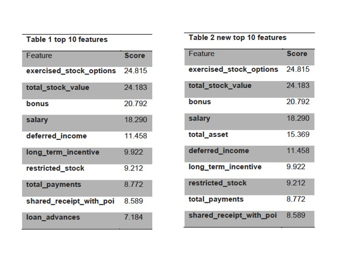
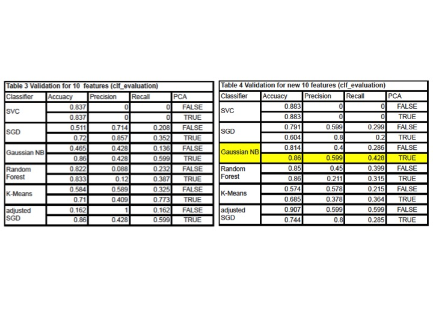
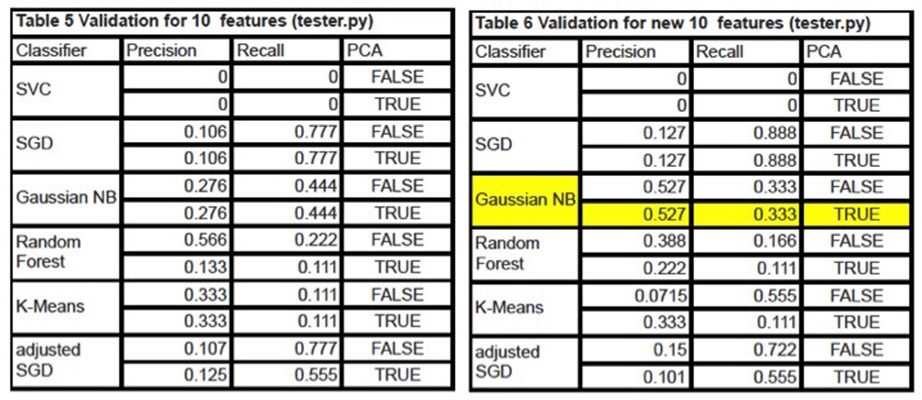

# Identifying Fraud from Enron Email
by Zhihui Xie
## Overview
Enron Corporation, which was one of the largest companies in the United States in 2000, was an American energy, commodities, and Services Company. In 2002, Enron had filed for bankruptcy because of accounting fraud. In the following federal investigation, a large database of over 600,000 emails generated by 158 employees of Enron was acquired. Subsequently, a copy of the database was purchased and released to public by Andrew McCallum. The dataset was used widely for machine learning studies. In this project, I built a machine learning model using “scikit-learn” built-in algorithm to predict a “person of interest” (“poi”), who may be involved in fraud in Enron. 
## Questions
###### 1. Summarize for us the goal of this project and how machine learning is useful in trying to accomplish it. As part of your answer, give some background on the dataset and how it can be used to answer the project question. Were there any outliers in the data when you got it, and how did you handle those?
The goal of this project is to build a predictive model to identify a “person of interest” (“poi”), who may be involved in fraud in Enron. Financial data and communication record of people in Enron are essential features that may help to uncover “pois”. Therefore, dataset extracted from Enron email corpus including financial and email information were analyzed and applied for training of machine learning algorithms. To do that, the dataset was explored first. The exploration shows that the dataset has 3066 data points, of which 1708 data points are valid. There are18 persons labeled as “poi” among total 146 persons, and 19 numeric features plus a “poi” feature and an “email_address” feature. The outlier identifier captured two types of outliers: 1) invalid name for a person: “TOTAL” (a summary of all persons) and “THE TRAVEL AGENCY IN THE PARK” (not a valid name); 2) invalid data points: “LOCKHART EUGENE E” (contains over 95% invalid values). To keep the quality of analysis, these outliers were removed before further analysis.
###### 2. What features did you end up using in your POI identifier, and what selection process did you use to pick them? Did you have to do any scaling? Why or why not? As part of the assignment, you should attempt to engineer your own feature that doesn't come ready-made in the dataset--explain what feature you tried to make, and the rationale behind it. If you used an algorithm like a decision tree, please also give the feature importances of the features that you use.
To select the most relevant and influential features, the SelectKBest module from scikit-learn was utilized. The top 10 features and their scores are listed in table1. Since “poi” may be more wealthier and frequent interaction with each other, I engineer two new features: "total_asset" and "fraction_of_messages_with_poi", which indicate the total asset of individual person and the individual person interaction with “poi”, respectively. These two features were added to the total features_list and the new top 10 features were selected (Table 2). 

Notably, the top 10 features in both lists (table1 and tables) are finical relevant data, which makes sense that “poi” may be participated in finical fraud. In the new top 10 features_list, the “loan_advances”, which only contains 3 valid data point, was replaced with "total_asset", a new-engineered feature.
The data for different features have different units (for example, number of messages and $usd) and different ranges (for example, total_asset and bonus have different ranges). Therefore, it’s critical to scale features to make sure that features would be weighted equally before applying for the machine learning algorithm classifiers. To achieve that, all features were scaled using a MinMaxScaler module.

###### 3. What algorithm did you end up using? What other one(s) did you try?
To play around the machine learning algorithms, I compared 5 algorithms (Support Vector Machines (SVC), Stochastic Gradient Descent (SGD), Gaussian Naive Bayes (Gaussian NB), Random Forests  and K-means) under the following conditions: 1) use top 10 features without new features and did not perform Principal Component Analysis (PCA); 2) use top 10 features without new features and performed Principal Component Analysis (PCA); 3) use new top10 features with “total_asset” and did not perform Principal Component Analysis (PCA); 4) use new top10 features with “total_asset” and performed Principal Component Analysis (PCA).
Through comparisons and evaluations (see question 5-validation), the final algorithm I chose is Gaussian Naive Bayes. As shown in table 1 and 2, all features contain continuous data. For continuous data, a typical assumption is that the continuous values that are associated with each class (“poi” or “non-poi”) are distributed according to a Gaussian distribution. Then, the probability of values in a class (for example “poi”) can be computed to predict whether they are associated with a given class. Performing Gaussian Naive Bayes algorithm, the features should be assumed as conditional independent. However, real world data are rarely independent. A recent study shows that naive Bayes still works well in dataset that the dependence between features do exist (The Optimality of Naive Bayes). Thus, I chose Gaussian Naive Bayes algorithm as my final algorithm even there are dependence between features in the dataset. The final condition I used for this algorithm is using new top10 features with “total_asset” and performing Principal Component Analysis (PCA) (highlight (yellow) in table 4 and table 6).

###### 4. What does it mean to tune the parameters of an algorithm, and what can happen if you don’t do this well?  How did you tune the parameters of your particular algorithm?  (Some algorithms don’t have parameters that you need to tune--if this is the case for the one you picked, identify and briefly explain how you would have done it if you used, say, a decision tree classifier). 
For Gaussian Naive Bayes, it doesn’t have parameters that need to be tuned. Instead, it computes the mean and variance of feature in an assumed class. Then, the probability of values in a given class is computed by equation for a normal distribution parameterized by mean and variance. While, I noted that adding a new feature (total_asset) greatly improved the performance of Gaussian Naive Bayes algorithm.
 	To do some exercises and test how tuning the parameters impacts performance of an algorithm, I tuned parameters for Stochastic Gradient Descent algorithm using grid_search.GridSearchCV. The following parameters were adjusted: 1) loss; 2) n_iter; 3) alpha. In addition, the “class_weight” was set as “auto”.
parameters = {"loss":("hinge", "log", "modified_huber", "perceptron", \
"epsilon_insensitive", "huber"), "n_iter":[1,5,10,20, 50, 100, 200, 500],\
"alpha": [1e-15, 1e-10, 1e-5, 1e-4, 1e-3, 1e-2, 1e-1]}
The adjustment of parameters did have some improvements for Stochastic Gradient Descent algorithm as shown in the validation section (next question 5), but the evaluation metrics did not meet the expected standard.

###### 5. What is validation, and what's a classic mistake you can make if you do it wrong? How did you validate your analysis?
Validation is an important process to asset the performance of a machine-learning algorithm. A classic mistake for my analysis is over-fitting. Usually, the machine-learning algorithm performed very well on the training dataset, but worse on the cross-validation and/or test datasets. 
To validate my analysis, I built an evaluation function (clf_evaluation) for testing 500 trials and measured the mean accuracy, precision and recall. Meanwhile, the provided evaluator (tester.py) was used as a second validation. The validation results for the tested algorithms are listed in tables 3-6. To compare the performance of algorithms with or without adding a new feature (total_asset), validations for 10 features (without adding a new feature) and for new 10 features (adding a new feature) were measured. Performance of algorithms except SVC and K-Means was improved with adding the total_asset feature. The SGD and K-Means algorithms performed well by using clf_evaluation for validation, but show low precision using tester.py for validation. The Gaussian NB algorithm performed well for both validations. To play around and check whether using Principal Component Analysis (PCA) would affect results of validations, results of with (PCA: True) and without (PCA: False) PCA were compared as shown in tables 3-6. PCA do improve performance for some algorithms including Gaussian NB algorithm as validated using clf_evualation.

###### 6. Give at least 2 evaluation metrics, and your average performance for each of them. Explain an interpretation of your metrics that says something human-understandable about your algorithm's performance.
The major evaluation metrics utilized here were precision and recall. Precision indicates the ratio of true positives to the records that are actually “pois”, which suggests how often 'false alarms' happens. Recall is the ratio of true positives to the records flagged as “pois”, which means how sensitive for the algorithm. I try to use accuracy, but even trained with a high accuracy, the algorithm may have low precision and recall. For the purpose of catching “pois”, precision and recall are more important than accuracy. Therefore, accuracy is not a good metric for analysis of this dataset. 
For the final algorithm (Gaussian NB) I chose, it performed pretty good because it showed relative high precision and recall scores (precision: 0.599, recall: 0.428 for clf_evaluation; precision: 0.527, recall: 0.333 for tester.py) in both validations. High precisions ensures truly capture the actual “pois”, while a high recall score ensures truly culpable individuals are included and labeled as “pois”. 

## Conclusion
In this project, I utilized Gaussian NB algorithm to build a predictive identifier to reveal person who may be involved in Enron fraud. The similar model may be potentially applied for other types of fraud checking including credit card fraud identification. Although the Gaussian NB algorithm model yielded a good precision but the recall score is not very high. To improve that, a further analysis would be to explore more features from email corpus for data training and test. 

## References:
[Introduction to Machine Learning (Udacity)](https://www.udacity.com/course/ud120)

[Machine Learning (Stanford/Coursera)](https://www.coursera.org/course/ml)

[scikit-learn: machine learning in Python](http://scikit-learn.org/)

[The Optimality of Naive Bayes](http://www.saedsayad.com/docs/Optimality_of_Naive_Bayes.pdf)

[Naive Bayes classifier - Wikipedia](http://en.wikipedia.org/wiki/Naive_Bayes_classifier)

[Enron - Wikipedia](http://en.wikipedia.org/wiki/Enron)

[Enron Corpus - Wikipedia](http://en.wikipedia.org/wiki/Enron_Corpus)

