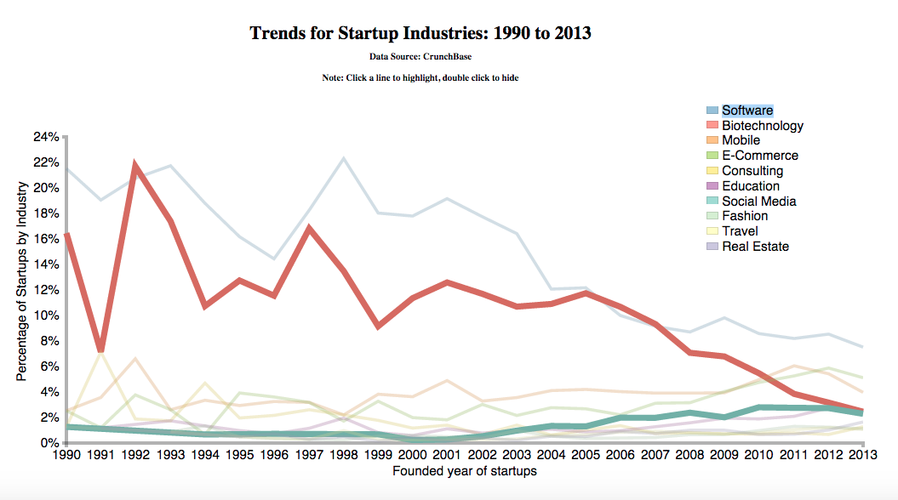
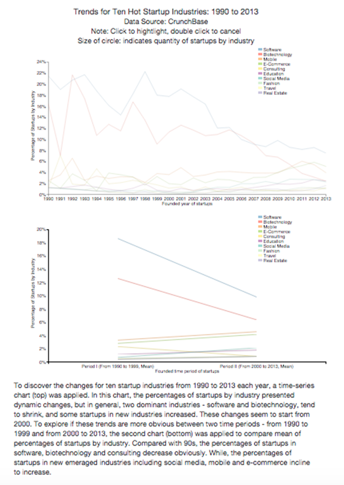

# Make Effective Data Visualization: Trends for Startup Industries: 1990 to 2013
#### by Zhihui Xie
## Summary
This data visualization is going to explore trends of hot startup industries from 1990 to 2013. The dataset was downloaded from CruchBase (https://info.crunchbase.com/about/crunchbase-data-exports/).
## Design
### Data Cleaning and Exploratory
The hypothesis of the design is the quantity or the percentage of startups may be different across different industries over time. To test the hypothesis, I first removed invalid data points in “market” and “founded_year” column using Rstudio. Then, I did the first exploration with all industries across all years in the data set:
 
This visualization contains too much information. The line chart was cluttered and it’s hard to get the effective comparisons. Therefore, the data were truncated and focused on hot industries (with number of startups greater than 1400) from 1990 to 2013. I did the second exploration as shown below:
 
This chart shows trends of increase of new founded startups in all industries from 1990 to 2007. The increases reach a peak in 2012 for software and E-commerce, then drop down. For biotechnology, the quantity of new founded startups decreased in 2008, increased in 2009-2010, and then dropped down quickly from then on. For mobile, the quantity of new founded startups decreased from 2011.

The chart above somehow reflects the trends of quantity of new founded startups in each industry over time. However, the total number of new founded startups also changed overtime. So, it’s important to compare the trends of occupied percentage of startups in industry. To do that, I did the third exploration: 
 
This new chart displays the trends of relative percentage of startups in industries, which addresses the question - what are the trends for startups over time. 
Finally, I loaded the exploration results to “clean_data_R” fold and exported the truncated data.
### Data Visualization 
#### Reasons for applying line chart and scatter chart
Using the cleaned data, I decided to creat a new chart with D3.js and dimple.js. I tried several different charts: line chart, scatter chart and bar charts. A bar chart is one of the most commonly used forms of presenting quantitative data and it is best used when comparing data from different categories. While line chart is usually applied for time-seriers data. Here, I want to explore how percentage of startups by industry changes over time. Thus, line chart is a better option for this purpose. Also, I noticed that the line chart (represents change of percentage of startup industry) combined with the scatter chart (represents number of startups) clearly represented the changes of percentage of startups in industries over time.
#### Improve the charts
But the circles in scatter chart are too dense in some area of the chart. Thus, I set "opacity" as zero for circles. To improve the chart, I also did the following adjustments: 1) used different colors to distinguish industries from each other; 2) format x and y-axes and add title for axes; 3) add title for the chart on top center; 4) add legend to indicate each industry; 5) add a mouse click event to highlight individual market. The initial chart was shown as below:

 
## Feedback
#### Interview #1
###### I quickly noticed the biotechnology was shrunk dramatically over time.  

###### I feel the mouse click event is awesome, but the line is too thin and hard to click it in a right way to highlight. 

###### I think the main takeaway is that percentage of these startups is decreasing.

#### Interview #2
###### I relized that this is an interactive graph and really like to move mouse over differet time period to see the detailed information. Include number of startups in the interactive graph is very informative since the trends of number of startups and percentage of startups in industries are different.

###### The main idea I gain was these hot startups decreased from 1990 to 2013. While, the open question is which startups are increased as compared to other startups. 

#### Interview #3
###### The highlight on biotechnology gave me a clear idea how this industry of startups occupied porportion changed across time. I think it will be better if you can select and highlight two or more industries for comparisons in the final plot.

###### In addition, though it's a challenge question, it's interesting and important to explore other industries that have increasing trends.

## Final Design - 1
In responding to comments from the interviews, I improved the chart with the following modifications:

1) Set style for all path with increase of "stroke-width";

2) To explore industries with increasing trends are challenge because there are many new emerged small industries with increasing trends, adding these industries will make the visualization too complex. To partially address this issue, I focused on industries with number of startups greater than 300. Then, I examined the changes of percentage of these industries overtime and found the following industries with increased trends in recent years: Real Estate, Travel, Fashion, Consulting, Education, Social Media. To simplify the graph, these industries are classified as "Other".

3) Two typical trends were highlighted in the final plot: biotechnology and other. 
The final chart of the data visualization is shown below:
 
The final code includes "index_final.html", "css/style_final.css", "js/myChart_final.js". 

## Feedback from Udacity Reviewer #1
###### 1) The animations you put in work well. I like the tooltip that shows up when hovering. However, it'll help if there's some note on the chart that the lines are clickable. I wouldn't have known they were clickable if I hadn't gone through the javascript code.

###### 2) Also the visualization is quite wide. It doesn't fit on my laptop screen unless I zoom out.

###### 3) It'll be great if you can add a brief explanation about why the time-series was a better visualization than the bar chart.

###### 4) This visualization looks great, and it's a great start. I'd put this more as an exploratory visualization than an explanatory. With an explanatory visualization, you really want to tell a story to the reader and get a point across. From your README file, it seems like the story you want to tell is that certain industries used to dominant the startup scene while other industries are now becoming more important. It's okay to make multiple charts if that helps tell the story.

###### 5) I think it'd be very interesting to separate out those "other" industries into their own separate lines. When I see the visualization, I want to know what are the new trending industries, and it seem like since 2003, it's all those industries in the "other" category.

###### 6) I thought a slope graph might interest you. It's a really effective yet simple way to show how a variable has changed over time. You definitely don't have to do something like this. http://charliepark.org/slopegraphs/ http://skedasis.com/d3/slopegraph/

###### I also wanted to point out that the y-axis confused me a little bit. At first I thought your graph was showing the percentage of companies in an industry that is a startup (for example, in 1990, 22% of all software companies were startups). Maybe Percentage of Startups by Industry would be clearer...

###### 7) I think you can help tell the story by putting more information in your data. For example, that the data comes from Crunchbase, that the data represents the percentage of startups by industry, etc.

###### 8) Have fun with it, and try to make the visualization really tell a story that's impactful and easy to understand. Another way to look at the data is splitting it up into time periods. For example, the 90s was when the internet started being available to the masses. Google started in 1998, and there was a big crash in 2001. Facebook came along in 2004, and smart phones went to mass market in 2007 with the iphone.

## Final Design - 2
In responding to comments from the reviewer, I improved the chart with the following modifications:

1)&7) I modified myChart.js code to add data source information and a note to indicate it's clickable.

2) The chart fits well in my screen. I narrowed the width a little bit in case is too big in other screen.

3) I added a section "Reasons for applying line chart and scatter chart" to state why I chose line chart and scatter chart.

4)&5) It's a good suggestion to separate industries in "Other" category. I showed all industries in "Other" category in the new final design.

6)&8) Both are great suggestions. While, here I want to tell a story about trends of certain industries druing a time period from 1990 to 2013, and see how they changed each year. I think the line chart is good for this purpose, but it's worthy and interesting to try the slope graph and split the data into certain time periods. I will play around with that.  

7) I changed the y-axis title to "Percentage of Startups by Industry" as suggested.

The revised chart of the data visualization is shown below:

 

In this final chart, one decreased trends (biotechnology) and one increased trends (Social Media) from 2005 to 2013 were highlighted in the final plot. 

## Feedback from Udacity Reviewer #2
###### 1) You are definitely on the right track, but I'd still consider the graphic exploratory rather than explanatory. To make an explanatory chart, you as the chart designer really need to take charge of leading the reader through what you want the reader to see. As already suggested in the last review, one option would be to make multiple charts. If you decide to make multiple charts, you can even keep the larger chart you currently have and then make more focused charts to tell your story.

###### 2) You could also add a paragraph pointing out to the reader what exactly makes this chart so interesting.

###### 3) There are a couple of small issues with your .js file. One is that some lines of code are very long (over 80 characters). You will want to make sure each line of code is under 80 characters.

###### 4) You also left in some code that you commented out. It's generally good practice to delete unused code from your final project.

## Final Design - 3
In responding to comments from the reviewer, I edited my charts:

1) Great suddestions about making explanatory chart. I noticed that the startups were dominated by certain industries such as software and biotechnology in 90s. However, the percentage of startups in these industries declined in 00s and startups in new industries emerged such as social media, E-commerce. Thus, I decided to compare percentage of startups by industry in two time period: 1990 - 1999 and 2000 - 2013, in addition to show time series of percentage of startups by industry. 

2) It's a good point to add a paragraph to explain the charts. I added a conclusion section for that.

3) I improved the code to avoid long lines.

4) I removed the unused code from final version.

The revised chart of the data visualization is shown below:

 

The final code includes "index_final.html", "css/style_final.css", "js/myChart_final.js". 

## Feedback from Udacity Reviewer #3

###### 1) You graphic is getting better with each submission. There are still a couple of things to think about. -I like the conclusion you've added in the README.md file. It will really help your index.html file stand on its own and be explanatory if you put this same information directly above or beneath your charts. The explanation doesn't have to be as long as it was in your conclusion, but including it will help you guide the reader through your story. -Your "z" value that maps to the circle radius isn't explained in your chart. When I hover over the chart and a big circle appears, I'm not sure what that represents. You should think about adding a legend that shows what the circle radius represents. -On the second chart, the x-axis is labeled 1990-1999 and then 2000-2013. I'm not sure what that refers to. Is the first point 1990 and the last point 2013? Or is 1990-1999 representing an average percentage during that time period? Please add a little more context on the x-axis so that I can understand what you are referring to there. And in the text you include for the people reading your chart, be sure to explain why you divided the data into those two periods. It's part of the story that you are telling. -I don't think you need the "click to highlight" on your second chart. It's very hard to click and unclick the Fashion, Travel and Real Estate lines. -Consider putting the two charts one above the other instead of side by side. That way on the second chart you can limit the y-axis to just 20% and even make the y-axis bigger so that I can see the Fashion, Travel and Real Estate lines better. Right now they're all on top of each other. -And when you include an explanation of a paragraph or two above or below your chart, make sure you explain why you want the reader to look at both plots. Think about what information does one plot provide that the other does not? And think about why you thought it was important for your reader to see both. Make sure you work that into the explanation that you give to the reader in your html file.

###### 2) Your files "index0.html", "index1.html", and "index2.html" aren't working. It's important that I can see these charts as part of your documentation showing how you've iterated and changed your project. I think the html files don't function properly because you are no longer including the csv files associated with those charts. Please put the csv files back in the right places so that those other html files work.

## Final Design - 4
In responding to comments from the reviewer, I edited my charts:

1) I included a brief conclusion under my charts. 

2) I add a note under title to indicate that the size of circles represent quantity of startups by industry.

3) add more information into the label of x-axis (each value is mean of percentages of startups by industry in each period) and edit the conclusion to make it clear.

4) I put one chart above another to make them easy to see and click lines.

5) I keep the mouse click event for the second chart because some line are very close and hard to see if not be highlighted.

6) I edited "index0.html" to "index3.html" to make them work for your reference.

The revised chart of the data visualization is shown below:

 

The final code includes "index_final.html", "css/style_final.css", "js/myChart_final.js". 

## Conclusion
In this project, I analyzed the trends for ten startup industries from 1990 to 2013 with data from CrunchBase. It's interesting to find that the percentages of startups by industry changed overtime in the visualization of time-series chart. In general, two dominant industries - software and biotechnology, tend to shrink from 90s to 00s, and startups in new industries including social media, e-commerce and mobile increased. These trends are more obvious by comparing mean of percentages of startups by industry between two time periods: 1990 - 1999 and 2000 - 2013. Compared with 90s, the percentage of startups in software, biotechnology and consulting decreased. While, the percentage of startups in new emeraged industries including social media, mobile and e-commerce increased. These trends fit well with development of industries and economy. In 90s, the available of internet to most of people and increase of investment in biomedical research boosted startups founded in software and biotechnology. Then, internet bubble crash and regression of economy in 00s caused decrease of percentage of startups in these two industries. Simultaneously, startups in new industries started to emerge. For example, Facebook (social media industry) founded in 2004, and smart phones (mobile industry) became popular in 2007. Although the percentage of startups in software and biotechnology declined, the number of startups still increased in 00s as compared to 90s. At the same time, there is a faster increase of total number of startups in other industries and new emerged industries, which results in decrease of percentage of startups in software and biotechnology.

## Discussion
The dataset was downloaded from CruchBase. There might be some limitations for this dataset. For example, the data are incomplete as many startups are not collected or reported in the system, or the classifications of industries are not completely correct. Even though, the trends shown here are still meaningful considering the data in the system are not totally biased.

## Resources
[CrunchBase](https://www.crunchbase.com/)

[Exploratory Data Analysis Using R (Udacity)](https://www.udacity.com/course/ud651)

[Data Visualization and D3.js (Udacity)](https://www.udacity.com/course/ud507)

[Dimple.js Documentation](dimplejs.org/)

[Stackoverflow](stackoverflow.com/)
